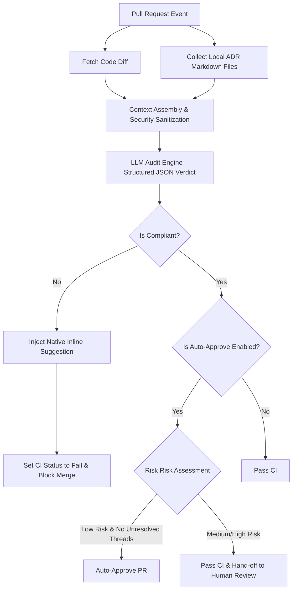

# 🛡️ AI-Driven ADR Enforcer

> **"Architecture Governance as Code"**
>
> A production-grade GitHub Action that implements **LLM-as-a-Judge** to dynamically audit incoming Pull Requests against your project's Architecture Decision Records (ADRs). It automatically catches architectural drift, blocks policy-violating commits, and offers self-healing suggestions directly inside the PR timeline.

[](https://github.com/y-matsuo081991/ai-adr-enforcer/releases)
[](https://github.com/marketplace/actions/ai-driven-adr-enforcer)
[](LICENSE)
[](#)

---

## 📖 The Problem & The Solution (Why This Exists)

In agile, high-velocity engineering organizations, establishing **Architecture Decision Records (ADRs)** is the gold standard for maintaining a long-term, maintainable codebase (e.g., *"All data fetching must be abstracted behind repository patterns,"* or *"Direct DB connections from BFF are strictly prohibited"*).

However, ADRs quickly become **stale and ignored**. Expecting human reviewers to remember and manually cross-reference dozens of markdown files on every Pull Request is a recipe for **Architectural Drift** and technical debt accumulation.

`AI-Driven ADR Enforcer` solves this. 
By integrating advanced LLMs (such as Google Gemini Pro/Flash) into your CI/CD pipeline, this Action dynamically reads your codebase's local ADR folder, audits the PR code diff, reasons about architectural compliance, and immediately rejects non-compliant PRs with actionable, inline solutions.

---

## ✨ Key Features

* 🚀 **Retrieval-Augmented Auditing (Local RAG):** Scans and parses your specified local ADR directory (e.g., `docs/adr/`) dynamically. It evaluates the PR code diff using the actual, live constraints of your project.
* 🧠 **LLM-as-a-Judge Reasoning:** Leverages structured output formats (JSON schemas) to force the LLM to provide rigorous step-by-step reasoning citing the exact ADR file and decision clause before drawing a compliance verdict (`Pass`/`Fail`).
* 🩹 **Self-Healing Suggestions (Auto-remediation):** When an architectural violation is detected, the Action generates compliant code alternatives and posts them as **native GitHub Multi-line Suggestions**—allowing developers to apply the fix with a single click.
* 🚦 **Automated Quality Gates:** Automatically leaves inline comments on the offending lines, fails the Status Check, and **blocks the PR from being merged** if critical violations are found.
* 🧪 **Hybrid Auto-Approval Pipeline:** For small changes (e.g., under 30 lines) or safe files (such as documentation, config changes, lockfiles), the Action performs a safety risk assessment. If marked as `low_risk`, it automatically approves the PR. If `medium` or `high` risk, it safely hands off to human reviewers.
* 🏷️ **Bypass Escape Hatch:** Offers an emergency bypass label (`bypass-adr`) to safely skip AI audits during high-severity production hotfixes.
* 🔒 **Enterprise-Grade Security:** Employs strict system prompt isolation to prevent prompt injection and implements comprehensive output sanitization to neutralize malicious links or hallucinated phishing domains.

---

## 🚀 Quick Start

Create a workflow file (e.g., `.github/workflows/adr-enforcer.yml`) in your repository:

```yaml
name: Architecture Governance

on:
  pull_request:
    types: [opened, synchronize, reopened]

jobs:
  enforce-adr:
    runs-on: ubuntu-latest
    permissions:
      contents: read
      pull-requests: write # Required for posting comments and approvals

    steps:
      - name: Checkout Code
        uses: actions/checkout@v4

      - name: Run AI-Driven ADR Enforcer
        uses: y-matsuo081991/ai-adr-enforcer@v1.0.0
        with:
          github_token: ${{ secrets.GITHUB_TOKEN }}
          gemini_api_key: ${{ secrets.GEMINI_API_KEY }}
          adr_directory: 'docs/adr'          # Path to your ADR markdown files
          fail_open: 'false'                 # If true, passes the CI if the LLM API is unavailable
          auto_approve: 'true'               # Enable the Hybrid Auto-Approval pipeline (Default: false)
          auto_approve_max_lines: '30'       # Threshold line count for auto-approval
```

### ⚠️ Prerequisite for Auto-Approve Permissions

If you set `auto_approve: 'true'`, you must configure your repository to allow GitHub Actions to issue Pull Request approvals. Without this, the runner will throw an `Unprocessable Entity` error.

1. Navigate to your repository's **Settings** ➔ **Actions** ➔ **General**.
2. Scroll to the bottom to find the **Workflow permissions** section.
3. Check the box for **"Allow GitHub Actions to create and approve pull requests"** and click **Save**.

> [!IMPORTANT]
> **Safety Interlock (Unresolved Conversations)**
> To preserve human decision authority, the Auto-Approval engine will immediately opt-out and skip execution if there is even a single **Unresolved Conversation** thread on the PR. It will only resume evaluation once all human comment threads are marked as "Resolved."

---

## 🔒 Advanced: High-Trust Enterprise GitHub App Integration

Using the default `${{ secrets.GITHUB_TOKEN }}` to issue reviews has a built-in security limitation: **GitHub prevents actions triggered by `GITHUB_TOKEN` from cascading into other workflows.** For example, an approval from `GITHUB_TOKEN` will not trigger your auto-merge or deployment pipelines, and may not count towards branch protection rule minimums.

To enable seamless, secure end-to-end automation, you should create a custom **GitHub App** to run the Enforcer.

### 🛠️ Step-by-Step Setup

1. **Create the GitHub App:**
   - Go to your Organization/User Settings ➔ **Developer Settings** ➔ **GitHub Apps** ➔ **New GitHub App**.
   - Disable the **Webhook Active** toggle (webhooks are not needed).
   - Set the following **Repository Permissions**:
     - **Pull requests:** `Read & write` (Required to post comments and approvals)
     - **Contents:** `Read-only` (Required to read the file diffs and ADR directory)
   - Click **Save** and note down the **App ID**.
   - Generate and download a **Private Key** (`.pem` file) from the bottom of the page.

2. **Register Secrets in Your Repository:**
   - Go to Repository **Settings** ➔ **Secrets and variables** ➔ **Actions** ➔ **New repository secret**:
     - `ADR_ENFORCER_APP_ID`: The App ID from step 1.
     - `ADR_ENFORCER_PRIVATE_KEY`: The entire raw contents of the downloaded `.pem` private key file.

3. **Update Your Workflow YAML:**
   - Use the official `actions/create-github-app-token` action to obtain an ephemeral token:

```yaml
name: Architecture Governance

on:
  pull_request:
    types: [opened, synchronize, reopened]

jobs:
  enforce-adr:
    runs-on: ubuntu-latest
    steps:
      - name: Generate GitHub App Token
        id: app-token
        uses: actions/create-github-app-token@v1
        with:
          app-id: ${{ secrets.ADR_ENFORCER_APP_ID }}
          private-key: ${{ secrets.ADR_ENFORCER_PRIVATE_KEY }}

      - name: Checkout Code
        uses: actions/checkout@v4

      - name: Run AI-Driven ADR Enforcer
        uses: y-matsuo081991/ai-adr-enforcer@v1.0.0
        with:
          github_token: ${{ steps.app-token.outputs.token }}
          gemini_api_key: ${{ secrets.GEMINI_API_KEY }}
          adr_directory: 'docs/adr'
          auto_approve: 'true'
```

---

## 💡 Real-World Example in Action

Let's demonstrate how this pipeline protects a project from architecture decay.

### 1. The Defined Architecture Rule (Local ADR)
File `docs/adr/001-database-selection.md` dictates:
```markdown
# 001. Database Selection for Blog Storage

## Context
We need a lightweight, zero-dependency database to facilitate trivial local setups.

## Decision
All article content must be saved and loaded strictly using **SQLite**. 
Using heavy external database servers (such as MySQL or PostgreSQL) that require external processes is strictly prohibited in this codebase.
```

### 2. A Developer's Pull Request (The Architectural Violation)
A developer attempts to introduce PostgreSQL to solve an edge-case indexing problem:

```diff
// src/db.js
- const db = new sqlite3.Database(':memory:');
+ const { Client } = require('pg');
+ const db = new Client({ connectionString: process.env.DATABASE_URL });
+ db.connect();
```

### 3. Automated Guardrail & Self-Healing Comment
Upon code push, the Action runs, catches the violation, fails the CI status check, and injects an inline suggestion:

> ### 🚨 Architecture Violation Detected!
> 
> The proposed code change introduces the `pg` client module to establish connection to a PostgreSQL database server. This is in direct violation of the project's architectural guidelines.
> 
> * **Violated Record:** `001-database-selection.md`
> * **Constraint Clause:** All article content must be saved and loaded strictly using **SQLite**.
> 
> #### 🩹 Self-Healing Suggestion
> ```suggestion
> const sqlite3 = require('sqlite3').verbose();
> const db = new sqlite3.Database(':memory:');
> ```

*The developer can simply click the **"Commit suggestion"** button inside the GitHub UI to safely apply the compliant fix and green-light the CI.*

---

## 🧠 System Architecture



---

## 🤝 Contributing

We welcome contributions to make architecture governance more automated and resilient! Please feel free to open Issues or submit Pull Requests.

## 📄 License

This project is licensed under the MIT License. See [LICENSE](LICENSE) for details.
