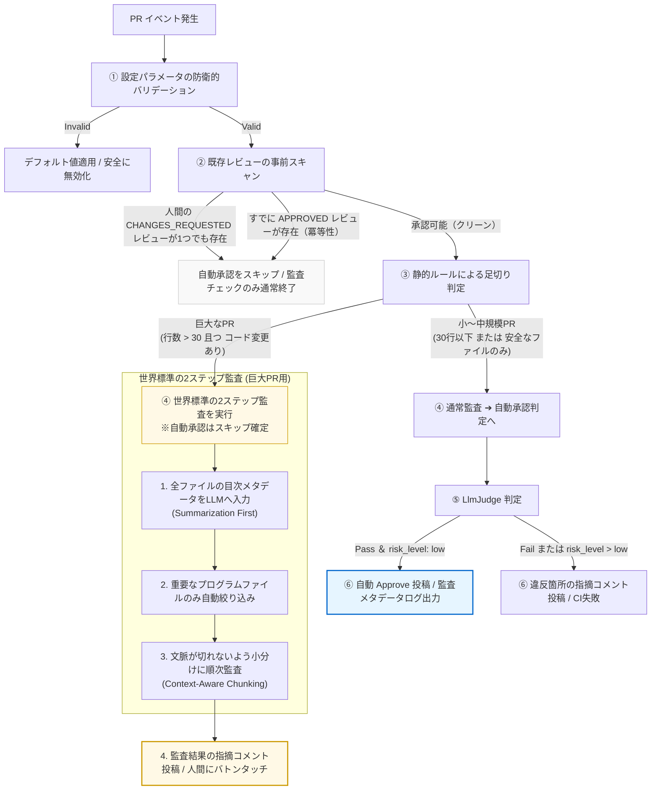
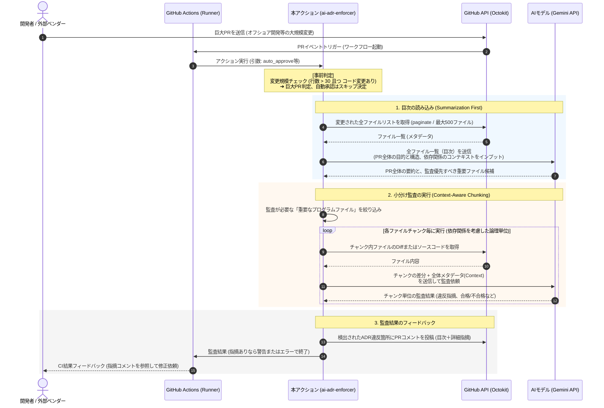

# ADR 012: ハイブリッド自動承認（Hybrid Auto-Approve）ポリシーの導入

* **ステータス:** Accepted
* **日付:** 2026-06-13

## 1. 背景と目的 (Context & Objective)
AIによるコード生成ツールの普及に伴い、Pull Request（PR）の提出数が爆発的に増加し、人間のレビュアーのキャパシティを超えることで、開発プロセス全体が停滞する「AIパラドクス（レビュー遅延）」が現場の深刻な課題となっています。

人間のレビュアーの認知負荷と作業時間を劇的に削減するためには、安全で低リスクなPRを人間が介在することなく自動的に「承認（Approve）」し、高速にマージ可能な状態にする仕組みが必要です。

しかし、自動承認を「AIの判断のみ」に委ねると、LLMの確率的な誤判定による不具合の混入リスクがあり、逆に「ファイルの拡張子などのルールのみ」に依存すると、ドキュメントのふりをして不正なスクリプトを仕込むようなセマンティックな脆弱性や、ADR違反を見落とす危険性があります。

したがって、本ツールに「最高水準の安全性」と「圧倒的なデリバリー速度」を両立した、世界標準の自動承認メカニズムを組み込みます。

## 2. 決定事項 (Decision)
安全かつ強力な自動承認を実現するため、以下の**「ハイブリッド自動承認（Hybrid Auto-Approve）ポリシー」**をアーキテクチャとして制定し、実装します。

### 2.1. 二重の安全基準（AND条件）による自動承認
以下の「AIによる推論判定（セマンティック・チェック）」と「静的ルールによる足切り（ルールベース・チェック）」の**両方を同時に満たす場合に限り**、本アクションが対象PRに対して自動的に `APPROVE` のレビューを投稿します。

```
【自動承認の成立条件】
AIによるリスク判定（Pass ＆ Low Risk） 
      AND
静的ルール判定（安全なファイルのみ、または変更規模が極めて小さい）
```

#### ① AIによるリスク判定（LlmJudgeの拡張と後方互換性）
*   `LlmJudge` の出力スキーマに `risk_level`（`low` | `medium` | `high`）を追加します。Geminiに「ADR違反がない（`pass`）」かつ「変更に伴うシステム的なリスクが十分に低い（`low`）」と判断させた場合のみ、この条件をクリアとします。
*   **【後方互換性の保証】**: プログラム側のZodスキーマ定義においては、`risk_level` をオプショナル（`.optional()` またはデフォルト値付き）として定義し、古いテストコードやLLMが旧フォーマットを返した場合でもスキーマ検証エラーでCIがクラッシュするのを完全に防ぎます。
*   **【タイムアウトの最適化と2層防御】**: ネットワークのハングアップを防ぎ、実運用での開発者のフィードバック効率（CIの待ち時間）を最適化するため、タイムアウトは以下の**「2層のタイムアウト防御」**で実装します。
    *   **1. LLM API個別タイムアウト (60秒)**: LLM（Gemini）への1回ごとのリクエストに対する制限時間。
    *   **2. アクション全体のグローバル・タイムアウト (180秒 / 3分)**: アクション実行開始からの合計制限時間。巨大PRの2ステップ監査など、ループ処理が長引いた場合でも最大3分で処理を打ち切り、**そこまでに得られた監査指摘をPRにコメントした上で、自動承認を安全にスキップして通常終了（縮退運転）**とします。これにより、どんなに巨大なPRであっても「3分以内に確実にCIが終わり、かつ途中までの監査指摘は100%返ってくる」という高い安定性と体験を両立します。

#### ② 静的ルールによる足切りと【低コスト化優先（早期オプトアウト）】
TypeScriptプログラム側で、以下のいずれかを満たす場合にクリアとします。
*   **安全なファイルのみの変更**: 変更されたすべてのファイルが、ドキュメント（`*.md`）、パッケージ定義（`package.json` 等）、設定ファイル（`tsconfig.json`, `*.yml` 等）などの静的資産である場合。
*   **変更規模の制限**: プログラムコードの変更であっても、PR全体の合計差分行数（追加・削除行数）が指定されたしきい値（例: 30行以下）と極めて小さく、影響範囲が局所的である場合。
*   **【低コスト化優先（早期オプトアウト）】**: LLM（LlmJudge）のAPIを無駄に呼び出すのを防ぐため、**「静的ルールによる足切りチェック」を LLM 呼び出しよりも先に実行**します。静的ルールで自動承認対象外と判定されたPRに対しては、LlmJudge を呼び出さずに即座に自動承認プロセスを終了させ、不要な遅延とAPIトークン代（コスト）を劇的に削減します。

#### ③ 巨大PRに対する全ファイルスキャンの強制と【API Rate Limit境界＆2ステップ監査ポリシー】
*   変更ファイル数が100件を超える巨大なPRであっても、すり抜けを防ぐために GitHub API の `octokit.paginate` を採用し、全ファイルを漏れなくチェックします。
*   **【API Rate Limit境界（防衛境界）】**: 自動生成ファイル等のコミットによる無制限なページングと GitHub API の制限（Rate Limit）枯渇を確実に防ぐため、スキャンする最大ファイル数に上限（例: 500ファイル）を設定します。この上限を超えた場合は「変更規模超過」として安全に自動承認をスキップ（縮退運転）させます。
*   **【巨大PRにおける自動承認の安全スキップ（人間にバトンタッチ）】**: 差分行数やファイル数が制限上限を超える巨大なPR（オフショア開発での一括コミット等）に対しては、セキュリティとすり抜け防止の観点から自動承認（Approve）は安全のためにスキップされます。
*   **【世界標準の2ステップ監査（Context-Aware Chunking）の強制】**: 巨大PRに対して監査を実行する際、単に1ファイルずつ完全にバラバラにAIに送ると、ファイル間の依存関係やアーキテクチャ全体の整合性（ADR違反）を見落とす「文脈の消失（Context Loss）」というAI of 落とし穴が発生します。これを防ぐため、本ツールは以下の世界標準の2ステップ監査を強制します。
    1.  **全体のメタデータ（目次・変更ファイル一覧）をLLMに先行して入力**し、PR全体の構造・目的（全体像）をLLMに把握させる（Summarization First）。
    2.  その上で、ADR違反が発生しやすい「重要なプログラムファイル」のみに自動で絞り込み、**ファイル間の文脈が維持される論理的なチャンクに小分け（Chunking）して順次監査を実行**する。
    これにより、巨大PRであってもAPIのトークン代やパンク（エラー）を完璧に防ぎつつ、高い精度で漏れなくADR監査を完遂し、AIによる問題指摘をPRコメントとして確実に残した後に人間のレビュアーへマージ判断を委ねます。

#### ④ 自動承認の重複実行防止と【人間のレビュー決定の絶対尊重（ガバナンス）】
*   自動承認を実行する前に、PRに投稿されている既存のレビューをスキャンします。すでに本アクション（またはBotアカウント）による `APPROVED` のレビューが存在する場合、多重にレビューを作成してPRタイムラインをスパム化するのを防ぐため、自動承認プロセスを安全にスキップ（冪等性を担保）します。
*   **【人間のレビューの絶対尊重】**: 人間の先輩レビュアーの意思決定とのコンフリクトを回避するため、既存レビューの走査時に `CHANGES_REQUESTED`（変更要求/却下）のレビューが1つでも存在する場合は、AIによる自動承認（Approve）を絶対にトリガーせず、処理を安全にスキップします。人間の意思決定はAIよりも常に優先されます。

#### ⑤ 堅牢な例外処理と縮退運転（Fail-Safe）
GitHub APIの一時的な500エラー、権限不足、またはRate Limit（API上限）などの予期せぬネットワーク障害が発生した場合、PRのCI全体（ワークフロー）をビルド失敗にするのではなく、例外をキャッチして警告ログを出力し、自動承認処理のみを安全にスキップ（縮退運転）して通常終了させます。これにより、自動承認に起因するPRマージフローのブロッキングを完全に防ぎ、システムのレジリエンスを担保します。

#### ⑥ 可観測性のための監査メタデータログ（Audit Trail）
本プロジェクトの絶対ルールである「ADRのファイル内容やDiff、LLMの生の推論ログを一切出力しない」という機密保護ルールを厳守しつつ、トラブルシューティング（RCA）を容易にするため、自動承認の合否判定プロセスのみを機密を含まないメタデータ（構造化された判定ログ：Audit Trail）として標準出力します。
出力例：
```
[Auto-Approve Audit Log]
- Enabled: true
- Is Safe Files Only: false
- Total Diff Lines: 18 (Threshold: 30) -> PASS
- AI Decision: pass
- AI Risk Level: low -> PASS
- Result: Approved (Review submitted)
```

#### ⑦ 設定パラメータの防衛的バリデーション（Defensive Boundaries）
`action.yml` から取得する `auto_approve_max_lines` などのインプット設定値に対して、不正な入力（文字列、負の数、非整数など）が指定された場合に、安全にデフォルト値（30）へフォールバックするか、自動承認を安全に無効化（Fail-Safe）する防衛的バリデーション層をコード境界に設けます。

### 2.2. プロセスフロー図（Mermaid）
本ハイブリッド自動承認および世界標準2ステップ巨大PR監査の実行プロセスを、以下に視覚化します。



### 2.3. 巨大PRにおける世界標準の2ステップ監査シーケンス（Mermaid）
巨大PR（オフショア開発等の大規模変更）に対し、本ツールがどのようにAPIトークン枯渇（Rate Limit）やハルシネーション（文脈消失）を防ぎながら監査を実行するかをシーケンスとして視覚化します。



### 2.4. GitHub Action設定（action.yml）へのインプット追加
利用者が自動承認を安全にオプトイン（有効化）し、挙動を制御できるよう、以下の設定項目を追加します。
*   `auto_approve`: 自動承認機能を有効にするかどうか（デフォルト：`false`（安全重視のFail-safe））
*   `auto_approve_max_lines`: 自動承認を許可する最大差分行数（デフォルト：`30`）

---

## 3. もたらされる結果 (Consequences)

* **【ポジティブ】** ドキュメント修正やテストコードの追加、軽微な定数変更など、人間が見る必要のない「安全なPR」が即座に自動承認され、現場のレビュー遅延が劇的に解消されます。
* **【ポジティブ】** 「AIの眼」と「プログラムによる静的チェック」、引続き「全ファイルスキャン」の多層防御により、AI of ハルシネーションや誤判定が原因で重大なバグやADR違反コードが自動マージされてしまうリスクを完全に排除します。
* **【ポジティブ】** 冪等性の担保により、コミットの追加プッシュ（`synchronize`）などでCIが再走した際にも不要な重複承認レビューが投稿されず、開発者体験（DX）を最高品質に保ちます。
* **【ポジティブ】** APIエラー発生時にもマージフローを阻害しない高いレジリエンスと、判定ログによる明確な可観測性（Observability）が確保されます。
* **【ネガティブ】** GitHub Actions上で自動Approveを実行するため、アクションが使用する `GITHUB_TOKEN` に対し、`pull-requests: write` の権限を設定（ワークフロー側に明示）する必要があります。
* **【ネガティブ】** `LlmJudge` の戻り値スキーマに `risk_level` が追加されるため、既存のモックテストコードをスキーマに合うように修正する必要があります。

### 💡 開発者への推奨プラクティス
同一PRに対して極めて短時間で連続プッシュ（`synchronize` イベントが連発）された際の同時実行による重複承認（競合状態：Race Condition）を確実に防ぐため、本アクションを採用するリポジトリのワークフロー設定において、以下の `concurrency`（同時実行制御）設定を適用することを強く推奨します。
```yaml
concurrency:
  group: ${{ github.workflow }}-${{ github.ref }}
  cancel-in-progress: true
```
